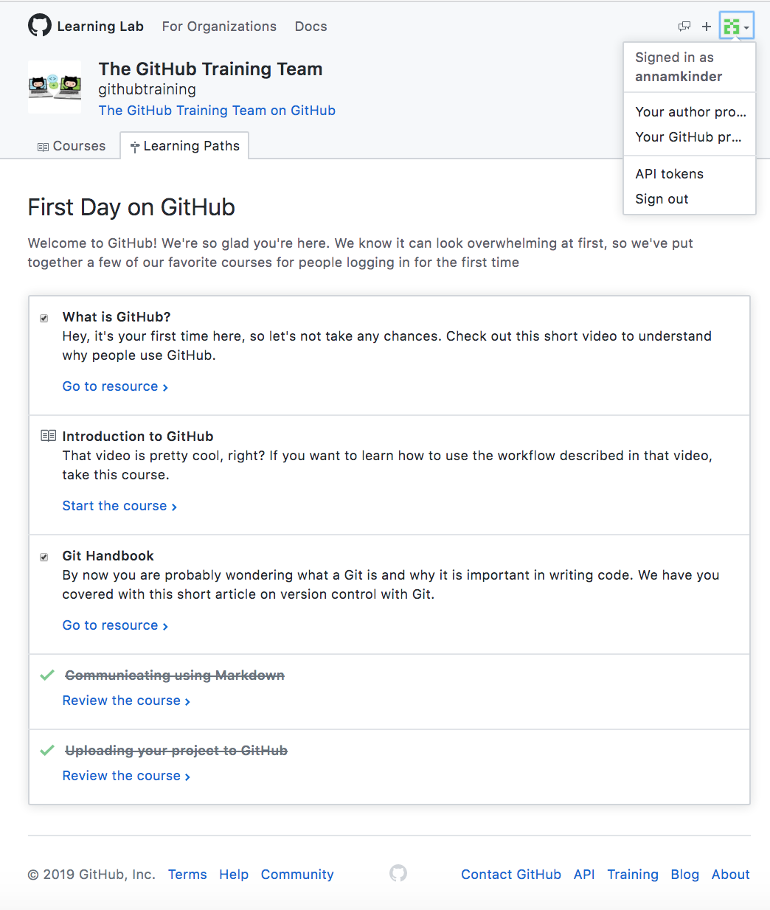
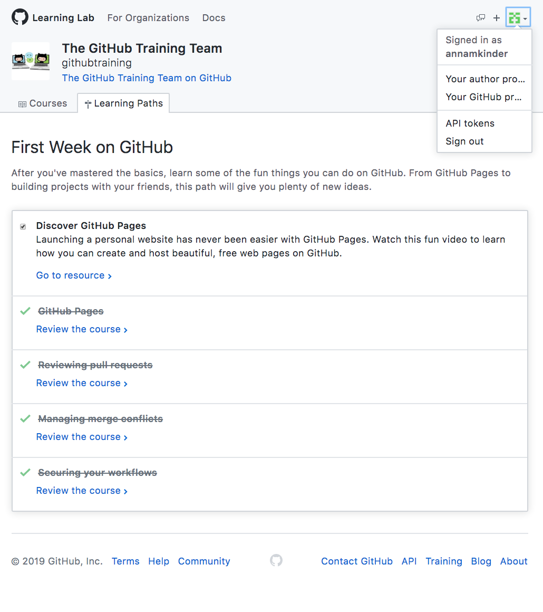

<h1> Technical Skills </h1>
Click on the drop-down menus below to see a description of each technical skill

<h2> Skills </h2>

GitHub

  <h4> Description: </h4>
  I completed the introductory GitHub learning labs, "First Day on GitHub" and "First Week on GitHub", offered on the GitHub website:
  https://lab.github.com/courses
  
  **Lessons Completed:**
  <ul>
    <li>Introduction to GitHub</li>
    <li>Communicating Using Markdown</li>
    <li>Uploading Projects to GitHub</li>
    <li>Creating a GitHub Homepage</li>
    <li>Merging Pull Requests</li>
    <li>Reviewing Pull Requests</li>
    <li>Managing Merge Conflicts</li>
    <li>Securing Workflows</li>
  </ul>
  
  
  

 
 

PowerBI

  <h4> Description: </h4>
  I completed the <a href="https://www.edx.org/course/analyzing-and-visualizing-data-with-power-bi-0">Analyzing and Visualizing Data with Power BI</a> course on edX. I learned how to create and edit a dashboard, create a report based off excel data, and better interpret data.
 
  
  **Proof of Completion:**
   
  <a href="Course | DAT207x | edX.pdf">edX Course</a>
  
  <a href="https://youtu.be/BKjC5Wvp-Rc">Dashboard Tour</a>
  
  
  

 

 

Linux

  <h4> Description: </h4>
  I completed Linux Adademy's LPI Linux Essentials Certification Training. 
  
   
  
  **Lessons Completed:**
  <ul>
    <li>Linux Evolution and Popular Operating Systems</li>
    <li>Major Open-Source Applications</li>
    <li>Open-Source Software and Licensing</li>
    <li>ICT Skills and Working in Linux</li>
    <li>Command Line Basics</li>
    <li>Using Command Line to Get Help</li>
    <li>Using Directories and Listing Files</li>
    <li>Creating, Moving, and Deleting Files</li>
    <li>Archiving Files on the Command Line</li>
    <li>Searching and Extracting Data from Files</li>
    <li>Turning Commands into a Script</li>
    <li>Choosing an Operating System</li>
    <li>Understanding Computer Hardware</li>
    <li>Where Data is Stored</li>
    <li>Your Computer on the Network</li>
    <li>Basic Security and Identifying User Types</li>
    <li>Creating User and Groups</li>
    <li>Managing File Permissions and Ownership</li>
    <li>Special Directories and Files</li>
  </ul>
   
  
  **Proof of Completion:**
   
  
  

 

 

IPSec and OpenVPN

  <h4> Description: </h4>
  

 

 

Amazon Web Services (AWS)

  <h4> Description: </h4>
  

 

 

PowerShell

  <h4> Description: </h4>
  

 

 

Salesforce

  <h4> Description: </h4>
  

