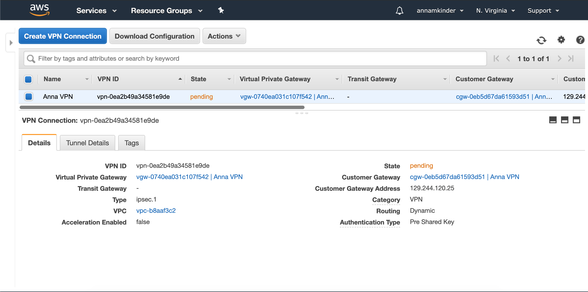

<h1> Anna Kinder's Technical Skills </h1>
Welcome to my Technical Skills Resume. My name is Anna Kinder. I'm currently a senior at The University of Tulsa, studying Computer Information Systems with a minor in Healthcare Informatics. Click on the drop-down menus below to see a description of each technical skill that I have learned throughout this semester. 

<h2> Skills </h2>

GitHub

  <h4> Description: </h4>
  I completed the introductory GitHub learning labs, "First Day on GitHub" and "First Week on GitHub", offered on the <a href="https://lab.github.com/courses">Github Website</a>. This training helped me to learn the basics needed to create my own Technical Resume on Github. I learned how to communicate with other users on Github to find help or inspiration. I learned how to create my own repository with branches to help keep my work organized and make projects easier when working with others. Furthermore, I learned how to make commits and introduce changes with pull requests. 
  
  **Lessons Completed:**
  <ul>
    <li>Introduction to GitHub</li>
    <li>Communicating Using Markdown</li>
    <li>Uploading Projects to GitHub</li>
    <li>Creating a GitHub Homepage</li>
    <li>Merging Pull Requests</li>
    <li>Reviewing Pull Requests</li>
    <li>Managing Merge Conflicts</li>
    <li>Securing Workflows</li>
  </ul>
   
  
  **Proof of Completion:**
   
  
  
  

 
 

PowerBI

  <h4> Description: </h4>
  I completed the <a href="https://www.edx.org/course/analyzing-and-visualizing-data-with-power-bi-0">Analyzing and Visualizing Data with Power BI</a> course on edX. I learned how to create and edit a dashboard, create a report based off excel data, and better interpret data. These skills will help me in the future if I ever need to put together data and present it. PowerBI allows users to better understand the information they are looking at and help point out the most important aspects. Using this traning, I was abe to complete my own <a href="https://www.youtube.com/watch?v=BKjC5Wvp-Rc&feature=youtu.be">PowerBI Dashboard</a> using sample data. 
 
  
  **Proof of Completion:**
   
  
  
  

  
  
  

 

 

Linux

  <h4> Description: </h4>
  I completed Linux Adademy's LPI Linux Essentials Certification Training. This course taught me about the Linux Operating system, which I did not know a lot about previously. It was very helpful to me to walk through the commands I was learning through training on the Terminal application. I used OS X while taking this course, but I learned more about the different operating systems and what they are useful for. Additionally, I learned about security, including, user types/groups, file permissions, and file ownership. 
  
   
  
  **Lessons Completed:**
  <ul>
    <li>Linux Evolution and Popular Operating Systems</li>
    <li>Major Open-Source Applications</li>
    <li>Open-Source Software and Licensing</li>
    <li>ICT Skills and Working in Linux</li>
    <li>Command Line Basics</li>
    <li>Using Command Line to Get Help</li>
    <li>Using Directories and Listing Files</li>
    <li>Creating, Moving, and Deleting Files</li>
    <li>Archiving Files on the Command Line</li>
    <li>Searching and Extracting Data from Files</li>
    <li>Turning Commands into a Script</li>
    <li>Choosing an Operating System</li>
    <li>Understanding Computer Hardware</li>
    <li>Where Data is Stored</li>
    <li>Your Computer on the Network</li>
    <li>Basic Security and Identifying User Types</li>
    <li>Creating User and Groups</li>
    <li>Managing File Permissions and Ownership</li>
    <li>Special Directories and Files</li>
  </ul>
   
  
  **Proof of Completion:**
   
  
  

 

 

AlgoVPN

  <h4> Description: </h4>
  I configured a VPN in the cloud using the Algo VPN Ansible scripts provided by Trail of Bits. With the help of this tutorial, I successfully deployed the Algo server, configured the VPN clients, set up an SSH tunnel, and added/removed users. Though challenging, this skill taught me more than just how to configure a VPN. I was able to use troubleshooting skills and working with fellow classmates to help solve this difficult task. If I ever need to build a VPN again, I have the experience to help guide me through the process. 
  
   
   
  
   **Proof of Completion:**
   
  

 

 

Amazon Web Services (AWS)

  <h4> Description: </h4>
  I completed the AWS Essentials training on Linux Academy. This training was very helpful because it provided hands on acitivities, along with videos. Through this training, I was able to set up my own AWS account and apply it. I was able to demonstrate this by setting up an OpenVPN and IPSecVPN using the AWS platform. A large number of companies are moving towards using AWS, and this traning helped me better understand why. 
  
   
   
**Proof of Completion:**

 

 

PowerShell

  <h4> Description: </h4>
  I completed LinkedIn's Premium PowerShell 5 Essential Training. In this training I learned how to install Windows Management Framework 5, run commands, discover commands, find and use local modules, select, store, and filter object data, create scripts, automate tasks, and use PowerShell remotely. I was taught how to get help from the help system, extend Powershell with modules and snap-ins, and automate administrative tasks. 
  
   
   
  
   **Proof of Completion:**
   
  

 

 

Automation Anywhere

  <h4> Description: </h4>
  I completed a portion of the Automation Anywhere University Essential Level Prep Courses (MBA Students). I was very excited to learn more about Automation Anywhere because the company I am working for uses it to automate tasks. Though the training provided valuable information, the platform needs some work. I ran into multiple road blocks of not having permission to access courses and learning paths, but completed what I could on the track. This traning gave me a lot of background information into how processes are chosen for automation and how to prioritize what to automate. Additionally, I learned how basic bots work. I really like how Automation Anywhere is friendly towards someone who isn't an expert in programming, but still likes to do it. The pre-built functions allow me to build a bot with knowing the basics of programming. 
  
  **Proof of Work:**
  
  

